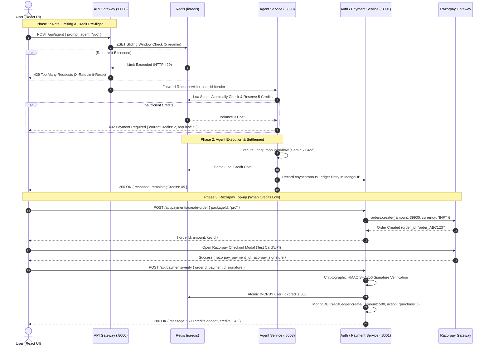

# Cortex AI: Rate Limiter, Credit Management & Razorpay Integration Plan

> **Target Audience**: Cortex AI Core Engineering & Autonomous AI Agents  
> **Status**: Ready for Future Implementation  
> **Location**: `docs/features/RATE_LIMITING_CREDITS_AND_RAZORPAY.md`  

---

## 1. System Architecture & Context

Cortex AI operates as an event-driven, high-performance multi-agent platform composed of the following microservices:

```
                                  ┌──────────────────────────┐
                                  │      Client (React)      │
                                  │  localhost:5173 (Vite)   │
                                  └─────────────┬────────────┘
                                                │ (Credentials: cookies)
                                                ▼
                                  ┌──────────────────────────┐
                                  │     API Gateway (:8000)  │
                                  │  - Auth Middleware       │
                                  │  - [NEW] Rate Limiter    │
                                  │  - [NEW] Payment Proxy   │
                                  └──────┬─────┬─────┬───────┘
                                         │     │     │
                 ┌───────────────────────┘     │     └────────────────────────┐
                 ▼                             ▼                              ▼
    ┌──────────────────────────┐  ┌──────────────────────────┐  ┌──────────────────────────┐
    │    Auth Service (:8001)  │  │    Chat Service (:8002)  │  │    Agent Service (:8003) │
    │ - Session management     │  │ - Conversation history   │  │ - LangGraph Agents       │
    │ - [NEW] Razorpay Orders  │  │ - MongoDB persistence    │  │   (chat, search, coding, │
    │ - [NEW] Credit Ledger    │  │ - Redis message cache    │  │    pdf, ppt, vision)     │
    │ - MongoDB `users` DB     │  └────────────┬─────────────┘  │ - [NEW] Credit Deductor  │
    └────────────┬─────────────┘               │                └─────────────┬────────────┘
                 │                             │                              │
                 └─────────────────────────┬───┴──────────────────────────────┘
                                           ▼
                                 ┌───────────────────┐
                                 │   Redis (:6379)   │
                                 │ - Session Store   │
                                 │ - Message Cache   │
                                 │ - Sliding Windows │
                                 │ - Atomic Credits  │
                                 └───────────────────┘
```

---

## 2. End-to-End Workflow Diagram



---

## 3. Feature 1: Agent Rate Limiter Using Redis

### 3.1 Why Redis Sliding Window Log?
- **Fixed Window** (`INCR` with 1-min expiration) suffers from the "boundary burst" flaw: a user can make 10 calls at 00:59 and 10 calls at 01:01, totaling 20 calls in 2 seconds.
- **Sliding Window Log** stores request timestamps inside a Redis Sorted Set (`ZSET`). Old timestamps outside the rolling 60-second window are continuously removed with `ZREMRANGEBYSCORE`.

### 3.2 Tiered Rate Limits per Agent Type
| Agent Type | Model Architecture | Compute Cost | Rolling 60s Window Limit |
| :--- | :--- | :--- | :--- |
| **`chat`** | Groq (`openai/gpt-oss-120b`) | Inexpensive, high token speed | **25 req / min** |
| **`search`** | Gemini 2.5 Flash + Google Search | Medium latency, web grounding | **15 req / min** |
| **`coding`** | Gemini 2.5 Flash | Code generation / review | **12 req / min** |
| **`pdf`** | Gemini 2.5 Flash / Groq fallback | Multi-page A4 document formatting | **6 req / min** |
| **`ppt`** | Gemini 2.5 Flash / Groq fallback | 5-6 slides interactive presentation | **6 req / min** |

### 3.3 Implementation: Gateway Rate Limiting Middleware
Create file: `backend/gateway/middlewares/rateLimiter.middleware.js`

```javascript
import redis from "../../shared/redis/redis.js";

const AGENT_LIMITS = {
  chat: 25,
  search: 15,
  coding: 12,
  pdf: 6,
  ppt: 6,
  default: 15,
};

/**
 * Sliding Window Rate Limiter using Redis Sorted Sets (ZSET)
 * Key Format: ratelimit:{userId}:{agentType}
 */
export const agentRateLimiter = async (req, res, next) => {
  // Extract user ID from authenticated session or fallback to client IP
  const userId = req.user?.userId || req.headers["x-user-id"] || req.ip;
  const agentType = (req.body?.agent || "default").toLowerCase().trim();
  const maxRequests = AGENT_LIMITS[agentType] || AGENT_LIMITS.default;
  const windowMs = 60 * 1000; // 60-second rolling window
  const now = Date.now();
  const key = `ratelimit:${userId}:${agentType}`;

  try {
    const multi = redis.multi();
    // 1. Evict entries older than (now - 60s)
    multi.zremrangebyscore(key, 0, now - windowMs);
    // 2. Add current request timestamp
    multi.zadd(key, now, `${now}-${Math.random().toString(36).substring(2, 7)}`);
    // 3. Count remaining entries in the current window
    multi.zcard(key);
    // 4. Set auto-expiry so idle keys are collected
    multi.expire(key, 65);

    const results = await multi.exec();
    const currentCount = results[2][1]; // Result of zcard

    // Set standard HTTP Rate Limiting headers
    res.setHeader("X-RateLimit-Limit", maxRequests);
    res.setHeader("X-RateLimit-Remaining", Math.max(0, maxRequests - currentCount));
    res.setHeader("X-RateLimit-Reset", Math.ceil((now + windowMs) / 1000));

    if (currentCount > maxRequests) {
      return res.status(429).json({
        success: false,
        error: "RateLimitExceeded",
        message: `Rate limit exceeded for ${agentType.toUpperCase()} Agent. Maximum allowed: ${maxRequests} requests per minute.`,
        retryAfter: 60,
      });
    }

    next();
  } catch (err) {
    console.error("[RateLimiter Error - Fail-Open]", err.message);
    // Fail-open: Never block legitimate users if Redis is temporarily unreachable
    next();
  }
};
```

---

## 4. Feature 2: High-Performance User Credits Management

### 4.1 The Two-Phase "Reserve & Settle" Pattern
Querying MongoDB for credit checks on every LLM token or agent turn introduces database locking, connection pool bottlenecks, and race conditions.  
**Solution**:
1. **In-Memory Redis Balance (`user:{id}:credits`)**: Checked and decremented atomically in `< 1ms` using a Lua script.
2. **MongoDB Write-Behind Ledger**: Asynchronously records transaction audits (`amount`, `balanceAfter`, `agentType`, `timestamp`) for compliance, user invoicing, and crash recovery.

### 4.2 Credit Cost Matrix
```javascript
export const AGENT_CREDIT_COSTS = {
  chat: 1,      // Conversational Q&A
  search: 2,    // Real-time search with citations
  coding: 2,    // Code generation
  pdf: 3,       // Print-ready A4 document
  ppt: 5,       // Complete 16:9 interactive presentation deck
};
```

### 4.3 Redis Lua Script for Atomic Deductions
Create file: `backend/services/agent/utils/creditManager.js`

```javascript
import redis from "../../../shared/redis/redis.js";
import axios from "axios";

const AUTH_SERVICE_URL = process.env.AUTH_SERVICE_URL || "http://localhost:8001";

// Atomic Lua script: Checks balance >= cost. If true, subtracts cost and returns remaining balance.
// If balance < cost, returns -1 without modifying balance.
const DEDUCT_CREDITS_LUA = `
  local balance = tonumber(redis.call('get', KEYS[1]) or '-1')
  local cost = tonumber(ARGV[1])
  
  if balance == -1 then
    return -2 -- Signal that key does not exist and needs hydration from DB
  end

  if balance >= cost then
    local new_balance = balance - cost
    redis.call('set', KEYS[1], new_balance)
    return new_balance
  else
    return -1 -- Insufficient balance
  end
`;

/**
 * Hydrates credit balance from MongoDB into Redis on cache miss.
 */
export const hydrateUserCredits = async (userId) => {
  const key = `user:${userId}:credits`;
  try {
    const res = await axios.get(`${AUTH_SERVICE_URL}/users/${userId}/credits`);
    const credits = res.data?.credits ?? 50; // 50 default free credits
    await redis.set(key, credits);
    return credits;
  } catch (err) {
    console.warn(`[HydrateCredits] Failed for ${userId}, setting default 50:`, err.message);
    await redis.set(key, 50);
    return 50;
  }
};

/**
 * Atomically checks and reserves credits before calling the agent.
 */
export const reserveCredits = async (userId, cost) => {
  const key = `user:${userId}:credits`;

  let remaining = await redis.eval(DEDUCT_CREDITS_LUA, 1, key, cost);

  // Key missing in Redis -> Hydrate from MongoDB and retry
  if (remaining === -2) {
    await hydrateUserCredits(userId);
    remaining = await redis.eval(DEDUCT_CREDITS_LUA, 1, key, cost);
  }

  if (remaining === -1) {
    const current = await redis.get(key);
    return {
      success: false,
      currentCredits: Number(current || 0),
      requiredCredits: cost,
    };
  }

  return {
    success: true,
    remainingCredits: remaining,
  };
};

/**
 * Refunds credits if the LLM invocation failed midway.
 */
export const refundCredits = async (userId, cost, reason = "agent_failure") => {
  const key = `user:${userId}:credits`;
  const newBalance = await redis.incrby(key, cost);
  console.log(`[Credits Refund] Refunded ${cost} credits to user ${userId}. New balance: ${newBalance} (${reason})`);
  return newBalance;
};
```

### 4.4 MongoDB Ledger Model
Create file: `backend/services/auth/models/creditLedger.model.js`

```javascript
import { Schema, model } from "mongoose";

const creditLedgerSchema = new Schema(
  {
    userId: { type: Schema.Types.ObjectId, ref: "User", required: true, index: true },
    amount: { type: Number, required: true }, // Negative for spend (-5), Positive for top-up (+100)
    balanceAfter: { type: Number, required: true },
    action: {
      type: String,
      enum: ["agent_run", "purchase", "welcome_bonus", "refund"],
      required: true,
    },
    agentType: { type: String, default: null },
    orderId: { type: String, default: null }, // Populated for Razorpay transactions
    metadata: { type: Schema.Types.Mixed, default: {} },
  },
  { timestamps: true }
);

export default model("CreditLedger", creditLedgerSchema);
```

---

## 5. Feature 3: Razorpay Integration (Dev & Learning Mode)

### 5.1 Package Pricing Matrix
| Package ID | Credits | Price (INR) | Amount in Paise (for Razorpay) |
| :--- | :--- | :--- | :--- |
| `starter` | **100 Credits** | ₹99 | `9900` |
| `pro` | **500 Credits** | ₹399 | `39900` |
| `creator` | **1,500 Credits** | ₹999 | `99900` |

### 5.2 Backend Payment Controller
Create file: `backend/services/auth/controllers/payment.controller.js`

```javascript
import Razorpay from "razorpay";
import crypto from "crypto";
import redis from "../../../shared/redis/redis.js";
import User from "../models/user.model.js";
import CreditLedger from "../models/creditLedger.model.js";

const razorpay = new Razorpay({
  key_id: process.env.RAZORPAY_KEY_ID || "rzp_test_YourTestKeyHere",
  key_secret: process.env.RAZORPAY_KEY_SECRET || "YourTestSecretHere",
});

const CREDIT_PACKAGES = {
  starter: { credits: 100, priceInPaise: 9900 },
  pro: { credits: 500, priceInPaise: 39900 },
  creator: { credits: 1500, priceInPaise: 99900 },
};

/**
 * 1. Create a Razorpay Order
 * POST /api/payments/create-order
 */
export const createPaymentOrder = async (req, res) => {
  try {
    const { packageId } = req.body;
    const pack = CREDIT_PACKAGES[packageId];

    if (!pack) {
      return res.status(400).json({ success: false, message: "Invalid credit package ID" });
    }

    const userId = req.user?.userId || req.headers["x-user-id"];
    const options = {
      amount: pack.priceInPaise,
      currency: "INR",
      receipt: `cortex_${userId}_${Date.now()}`,
      notes: {
        userId: String(userId),
        packageId,
        credits: pack.credits,
      },
    };

    const order = await razorpay.orders.create(options);

    return res.status(200).json({
      success: true,
      orderId: order.id,
      amount: order.amount,
      currency: order.currency,
      keyId: process.env.RAZORPAY_KEY_ID,
      credits: pack.credits,
    });
  } catch (err) {
    console.error("[Razorpay createPaymentOrder Error]", err);
    return res.status(500).json({ success: false, error: err.message });
  }
};

/**
 * 2. Cryptographic Signature Verification & Atomic Top-up
 * POST /api/payments/verify
 */
export const verifyPayment = async (req, res) => {
  try {
    const { razorpay_order_id, razorpay_payment_id, razorpay_signature, packageId } = req.body;
    const userId = req.user?.userId || req.headers["x-user-id"];
    const pack = CREDIT_PACKAGES[packageId];

    if (!pack) {
      return res.status(400).json({ success: false, message: "Invalid package" });
    }

    // Step A: Cryptographic HMAC SHA256 Signature Verification
    const body = `${razorpay_order_id}|${razorpay_payment_id}`;
    const expectedSignature = crypto
      .createHmac("sha256", process.env.RAZORPAY_KEY_SECRET)
      .update(body.toString())
      .digest("hex");

    if (expectedSignature !== razorpay_signature) {
      return res.status(400).json({
        success: false,
        message: "Payment verification failed: Invalid cryptographic signature",
      });
    }

    // Step B: Idempotency Protection (prevent double-crediting if replayed)
    const idempotencyKey = `payment:processed:${razorpay_payment_id}`;
    const alreadyProcessed = await redis.get(idempotencyKey);
    if (alreadyProcessed) {
      return res.status(200).json({
        success: true,
        message: "Payment already processed",
        credits: await redis.get(`user:${userId}:credits`),
      });
    }
    // Mark payment processed for 7 days
    await redis.set(idempotencyKey, "1", "EX", 86400 * 7);

    // Step C: Atomically increment Redis credit balance
    const redisKey = `user:${userId}:credits`;
    const newBalance = await redis.incrby(redisKey, pack.credits);

    // Step D: Write to MongoDB User & CreditLedger
    await Promise.all([
      User.findByIdAndUpdate(userId, { $inc: { credits: pack.credits } }),
      CreditLedger.create({
        userId,
        amount: pack.credits,
        balanceAfter: newBalance,
        action: "purchase",
        orderId: razorpay_order_id,
        metadata: {
          paymentId: razorpay_payment_id,
          amountPaise: pack.priceInPaise,
        },
      }),
    ]);

    return res.status(200).json({
      success: true,
      message: `Payment verified! Added ${pack.credits} credits to your account.`,
      credits: newBalance,
    });
  } catch (err) {
    console.error("[Razorpay verifyPayment Error]", err);
    return res.status(500).json({ success: false, error: err.message });
  }
};
```

### 5.3 Frontend React Razorpay Checkout Component
Create file: `frontend/src/components/CreditTopupModal.jsx`

```jsx
import { useState } from 'react';
import axios from 'axios';

const PACKAGES = [
  { id: 'starter', name: 'Starter Pack', credits: 100, price: '₹99', badge: 'Basic' },
  { id: 'pro', name: 'Pro Creator', credits: 500, price: '₹399', badge: 'Popular', highlight: true },
  { id: 'creator', name: 'Studio Ultra', credits: 1500, price: '₹999', badge: 'Best Value' },
];

export const CreditTopupModal = ({ isOpen, onClose, user, onCreditsUpdated }) => {
  const [loadingPack, setLoadingPack] = useState(null);

  if (!isOpen) return null;

  const loadRazorpayScript = () => {
    return new Promise((resolve) => {
      if (window.Razorpay) return resolve(true);
      const script = document.createElement('script');
      script.src = 'https://checkout.razorpay.com/v1/checkout.js';
      script.onload = () => resolve(true);
      script.onerror = () => resolve(false);
      document.body.appendChild(script);
    });
  };

  const handleCheckout = async (packageId) => {
    try {
      setLoadingPack(packageId);
      const isLoaded = await loadRazorpayScript();
      if (!isLoaded) {
        alert('Could not connect to Razorpay SDK. Check your internet connection.');
        setLoadingPack(null);
        return;
      }

      // 1. Create order on backend
      const { data } = await axios.post('/api/payments/create-order', { packageId }, { withCredentials: true });

      // 2. Open Razorpay Modal
      const options = {
        key: data.keyId,
        amount: data.amount,
        currency: data.currency,
        name: 'Cortex AI Studio',
        description: `Top-up ${data.credits} Agent Credits`,
        order_id: data.orderId,
        prefill: {
          name: user?.name || '',
          email: user?.email || '',
        },
        theme: {
          color: '#9333ea', // Sleek Cortex purple
        },
        handler: async function (response) {
          // 3. Verify on backend
          const verifyRes = await axios.post('/api/payments/verify', {
            razorpay_order_id: response.razorpay_order_id,
            razorpay_payment_id: response.razorpay_payment_id,
            razorpay_signature: response.razorpay_signature,
            packageId,
          }, { withCredentials: true });

          if (verifyRes.data?.success) {
            onCreditsUpdated?.(verifyRes.data.credits);
            onClose();
          }
        },
      };

      const paymentObject = new window.Razorpay(options);
      paymentObject.open();
    } catch (err) {
      console.error('Checkout error:', err);
      alert(err.response?.data?.message || 'Payment initiation failed.');
    } finally {
      setLoadingPack(null);
    }
  };

  return (
    <div className="fixed inset-0 z-50 bg-black/80 backdrop-blur-md flex items-center justify-center p-4">
      <div className="bg-[#0b0e17] border border-white/[0.1] rounded-2xl max-w-lg w-full p-6 shadow-2xl">
        <div className="flex items-center justify-between pb-4 border-b border-white/[0.08]">
          <div>
            <h3 className="text-lg font-bold text-white">Top-up Agent Credits</h3>
            <p className="text-xs text-slate-400">Unlock more presentations, executive PDFs, and intelligence searches</p>
          </div>
          <button onClick={onClose} className="text-slate-400 hover:text-white p-1">✕</button>
        </div>

        <div className="grid grid-cols-1 sm:grid-cols-3 gap-3 my-6">
          {PACKAGES.map((pkg) => (
            <div
              key={pkg.id}
              className={`p-4 rounded-xl border flex flex-col justify-between transition-all ${
                pkg.highlight
                  ? 'bg-purple-950/30 border-purple-500/50 shadow-lg shadow-purple-900/20'
                  : 'bg-white/[0.02] border-white/[0.08] hover:border-white/[0.2]'
              }`}
            >
              <div>
                <span className="text-[10px] font-semibold text-purple-400 uppercase tracking-wider">{pkg.badge}</span>
                <h4 className="text-xl font-bold text-white mt-1">{pkg.credits}</h4>
                <p className="text-xs text-slate-400">Credits</p>
                <div className="text-lg font-semibold text-white mt-3">{pkg.price}</div>
              </div>
              <button
                disabled={loadingPack !== null}
                onClick={() => handleCheckout(pkg.id)}
                className={`mt-4 w-full py-2 rounded-lg text-xs font-semibold cursor-pointer transition-all active:scale-95 ${
                  pkg.highlight
                    ? 'bg-gradient-to-r from-purple-600 to-indigo-600 text-white hover:from-purple-500 hover:to-indigo-500 shadow-md'
                    : 'bg-white/[0.08] hover:bg-white/[0.15] text-slate-200'
                }`}
              >
                {loadingPack === pkg.id ? 'Loading...' : 'Select'}
              </button>
            </div>
          ))}
        </div>

        <div className="text-[11px] text-slate-500 text-center flex items-center justify-center gap-1">
          <span>🔒 Secured with Razorpay (Test Environment) &bull; Simulated UPI & Cards</span>
        </div>
      </div>
    </div>
  );
};
```

---

## 6. Prompt to Launch Implementation in a New Agent Chat

When you are ready to implement these features in a new conversation, paste the following prompt directly into your AI coding assistant:

```markdown
Hello Antigravity! I would like you to implement the Rate Limiting, User Credits System, and Razorpay Integration for Cortex AI.

Before writing code, please perform the following discovery steps:
1. Review the detailed implementation blueprint in `docs/features/RATE_LIMITING_CREDITS_AND_RAZORPAY.md`.
2. Inspect the current codebase architecture:
   - Gateway at `backend/gateway/index.js` and middlewares in `backend/gateway/middlewares/`.
   - Redis connection in `backend/shared/redis/redis.js`.
   - Agent controller & graph in `backend/services/agent/controllers/agent.controller.js`.
   - Auth service models in `backend/services/auth/models/`.
   - Frontend state and components in `frontend/src/`.
3. Check running terminal processes and ensure microservice ports remain undisturbed (8000 Gateway, 8001 Auth, 8002 Chat, 8003 Agent, 5173 Frontend).

Implementation Steps to execute in order:
- Step 1: Implement the Redis sliding-window rate limiter middleware (`agentRateLimiter`) and attach it to the Gateway's `/api/agent` route.
- Step 2: Implement atomic credit reservations via the Redis Lua script in `backend/services/agent/utils/creditManager.js` and create the `CreditLedger` schema in Auth Service.
- Step 3: Wire credit pre-check and post-settlement into `agent.controller.js` so insufficient credits return HTTP 402.
- Step 4: Add Razorpay order creation (`/api/payments/create-order`) and HMAC SHA256 signature verification (`/api/payments/verify`) in Auth Service with idempotency caching in Redis.
- Step 5: Mount payment routes in Gateway and build the `CreditTopupModal.jsx` component in frontend.
- Step 6: Validate `npm run build` in frontend and verify all service health endpoints.

Please confirm you understand the architecture and begin with Step 1!
```

---

## 7. Checklist for Production Readiness

- [ ] Ensure Redis persistence (`appendonly yes`) is enabled in `backend/docker-compose.yml`.
- [ ] Add `RAZORPAY_KEY_ID` and `RAZORPAY_KEY_SECRET` to `.env.example` in both Gateway and Auth services.
- [ ] Set up Razorpay Webhook listener with secret verification for background payment confirmations.
- [ ] Maintain the fail-open fallback so a temporary Redis outage never causes total service downtime for active users.
